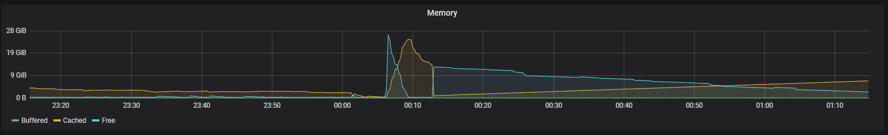

# Заголовок первого уровня Twitter Bootstrap

## Заголовок второго уровня
обычный текст
**жирный текст**
*курсив*

## Установка
утсновку делаем так
* spisok 1
* spisok 2
## Начало работы
1. клонировать проект
1. install
1. ...

[text](https://localhost)



```html
<html>
</html>
```

```java
System.out.printLn("dfsa")

```

`<html> </html>`

